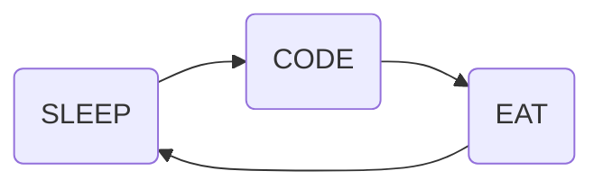

<!--### Hi there 👋

**Nothing-avil/Nothing-avil** is a ✨ _special_ ✨ repository because its `README.md` (this file) appears on your GitHub profile.

Here are some ideas to get you started:

- 🔭 I’m currently working on ...
- 🌱 I’m currently learning ...
- 👯 I’m looking to collaborate on ...
- 🤔 I’m looking for help with ...
- 💬 Ask me about ...
- 📫 How to reach me: ...
- 😄 Pronouns: ...
- ⚡ Fun fact: ...
-->


<br>
<br>
<p align="center">
    <h1 align="center">✩&emsp;Sandarbh Singhal&emsp;✩</h1>
</p>
<br>
<p align="center">
    
</p>
<br>
<br>
<br>
<div align="center">
  
  
  
  
</div>

###

<div align="center">

<!--    -->
<!--   https://github-readme-stats-git-masterrstaa-rickstaa.vercel.app/api?username=adityaseth777&&show_icons=true&theme=dark -->
  
  <a href="https://leetcode.com/Nothing_avil/"></a>
<!--     <a href="https://leetcode.com/Nothing-avil/"></a> -->
</div>


## Hello, Nice to Meet You !!

```
████████████████████████████████████████████████████████████  ██╗  ██╗███████╗██╗     ██╗      ██████╗
████████████████████████████████████████████████████████████  ██║  ██║██╔════╝██║     ██║     ██╔═══██╗
███████████████████████████████████`.        ╙██████████████  ███████║█████╗  ██║     ██║     ██║   ██║
████████████████████████████████▀  ¿▓▓▓▓▓▓▓▓▄/ "████████████  ██╔══██║██╔══╝  ██║     ██║     ██║   ██║
██████████████████████████████▀.  ▓▓▓▓▓▓▓▓▓▓▓▓   ▐██████████  ██║  ██║███████╗███████╗███████╗╚██████╔╝▄█╗
██████████████████████████████ `  ▓▓▓▓▓▓▓▓▓▓▓▓  ` ██████████  ╚═╝  ╚═╝╚══════╝╚══════╝╚══════╝ ╚═════╝ ╚═╝
██████████████████████████████ `  ▓▓▓▓▓▓▓▓▓▓▓▓   ▄██████████
▄▀█████████████████████████████▌  ▀▀▓▓▓▓▓▓▓▌╓╖. ████████████  ███╗   ██╗██╗ ██████╗███████╗  ████████╗ ██████╗
▀█▄▀█████████████████████████████▄ ╩╦╙▀▀▀▀▀ ╣`,█████████████  ████╗  ██║██║██╔════╝██╔════╝  ╚══██╔══╝██╔═══██╗
█▄▀█▄╙████████████████████▀▀▀▀█████▄▄ .... ,▄███████▀███████  ██╔██╗ ██║██║██║     █████╗       ██║   ██║   ██║
███▄▀█▄╙████████████████▀  ╪╢%╦══~╓,└ ╚▒▒▒ ╙▀|,╓╓═╤H   ▀████  ██║╚██╗██║██║██║     ██╔══╝       ██║   ██║   ██║
█████-▀█▌▄▀████████████   ║▒▒▒▒▒▒▒▒▒▒╢╦ ╘ -╣▒▒▒▒▒▒▒▒▒╢╕   ▀█  ██║ ╚████║██║╚██████╗███████╗     ██║   ╚██████╔╝
██████▄▀██└║███████████▄          ═╕╕╕╕╕═╕═══════       ▄▄▄▄  ╚═╝  ╚═══╝╚═╝ ╚═════╝╚══════╝     ╚═╝    ╚═════╝
████████▄▀█▌║███  ████▌         ╕   ╩▒▒▒▒▒▒▒▒▒Ñ          ███
██████████▌Ö▓▌   ▀██████`╔▒▒╣ █ ▒▒m   ╚▒╢▒▒▒╩ -╣▒ ▌ ▒▒▒ ████  ███╗   ███╗███████╗███████╗████████╗  ██╗   ██╗ ██████╗ ██╗   ██╗
████████ -"" ∞╙,▀.╙▀███╜ ▒▒▒ ▄█ Ñ   -   S.  ═▒▒▒▒ █ ║▒▒╕└███  ████╗ ████║██╔════╝██╔════╝╚══██╔══╝  ╚██╗ ██╔╝██╔═══██╗██║   ██║
████████▄ -«   ∞▄.▀",╓═     ╒██   ═╣▒▒ `Ñ╛        █▌ ▒▒▒ ███  ██╔████╔██║█████╗  █████╗     ██║      ╚████╔╝ ██║   ██║██║   ██║
█████████▌ º     ╤╣▒╣╩^",▄▄███▀  ▒▒╣"     ''''''' ▀▀     `██  ██║╚██╔╝██║██╔══╝  ██╔══╝     ██║       ╚██╔╝  ██║   ██║██║   ██║
█████████  ▌       ▄▄████████─         ---------    L'▒▒▒ ██  ██║ ╚═╝ ██║███████╗███████╗   ██║        ██║   ╚██████╔╝╚██████╔╝▄█╗
▀▀▀▀▀▀▀▀▀▀▀▀▀-     ▀▀▀▀▀▀▀▀▀▀       '╧╧╧╧╧╧╧╧╧`     ╚ ╧╧╧- ▀  ╚═╝     ╚═╝╚══════╝╚══════╝   ╚═╝        ╚═╝    ╚═════╝  ╚═════╝ ╚═╝
```


## DAILY RECURSIVE CYCLE




<h3 align="left">    My Stats :</h3>

<div align="center">
  
</div>

<br>


###

<h3 align="left">🛠 Language and tools</h3>

###

<div align="left">
  <a href="https://devdocs.io/javascript/" target="_blank" rel="noreferrer">   </a> 
  
  <a href="https://devdocs.io/react/" target="_blank" rel="noreferrer">   </a> 
  
  <a href="https://www.w3.org/html/" target="_blank" rel="noreferrer">   </a> 
  
  <a href="https://www.w3schools.com/css/" target="_blank" rel="noreferrer">  </a> 
  
  <a href="https://www.python.org" target="_blank" rel="noreferrer">   </a> 
  
  <a href="https://www.cprogramming.com/" target="_blank" rel="noreferrer">  </a> 
  
  <a href="https://www.java.com" target="_blank" rel="noreferrer">  </a> 
  
  <a href="https://www.w3schools.com/cpp/" target="_blank" rel="noreferrer">  </a> 
  
  <a href="https://code.visualstudio.com/" target="_blank" rel="noreferrer">  </a> 
  
  <a href="https://docs.github.com/en/get-started/quickstart/git-and-github-learning-resources" target="_blank" rel="noreferrer"> </a> 
   
  <a href="https://codepen.io/" target="_blank" rel="noreferrer">  </a> 
</div>

###


###


###

<h3 align="left"> Connect with me...</h3>

###

<div align="left">
  <a href="https://www.instagram.com/sandarbh2002/" target="_blank">
    
  </a>
  <a href="https://discordapp.com/users/sandarbh8709" target= "_blank">
  
  </a>
  <a href="mailto:sandarbhsinghal123@gmail.com" target="_blank">
    
  </a>
  <a href="https://www.linkedin.com/in/sandarbh-singhal/" target="_blank">
    
  </a>
  <a href="https://codesandbox.io/u/sandarbhsinghal123" target="_blank">
    
  </a>
  &nbsp;
  <a href="https://leetcode.com/Nothing_avil/" target="blank">
  </a>
  &nbsp;
  <a href="https://auth.geeksforgeeks.org/user/sandarbhsi3d62" target="blank">
  </a>
</div>

###


## 🏆 GitHub Trophies


###


## 🐍 Snake-Eating My Contribution
<br clear="both">


###


<!---->


###

##  Random Dev Quote


<br>

## <div align="center" height="1" > Thanks for Visiting </div>


[](https://visitcount.itsvg.in)
